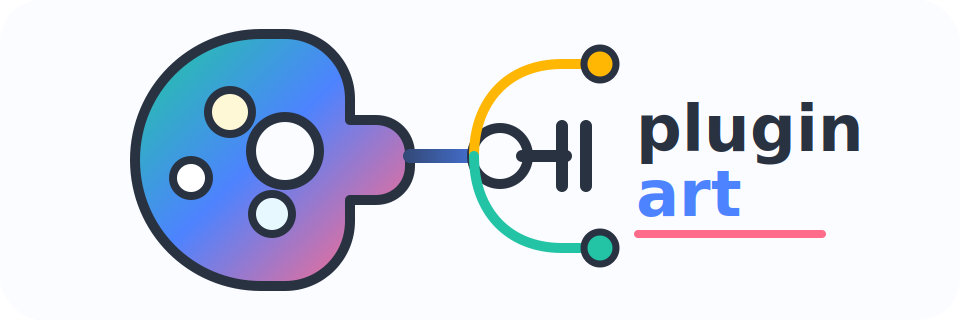

<p align="center">
  
</p>

# pluginart

`pluginart` is a CLI plus Go, Python, and TypeScript runtimes for building language-agnostic plugin systems. Hosts manage plugins from `pluginart.toml`; plugins run as binaries, Docker containers, or remote TCP services; all calls use a FlatBuffers-based wire protocol with contract-hash verification at handshake time.

## Install

```bash
go install github.com/dlahoza/pluginart/cmd/pluginart@latest
brew install flatbuffers
```

Runtime packages are published as:

- Go: `github.com/dlahoza/pluginart/pkg/runtime`
- PyPI: `pluginart`
- npm: `pluginart`

## Mental Model

The schema defines payload tables and method names. Generated clients give host code method wrappers. The host runtime starts, health-checks, restarts, calls, and shuts down plugins. Go, Python, and TypeScript generation hide the pluginart RPC envelope while still using FlatBuffers payload builders.

## Quickstart: Go Host

```bash
pluginart gen bindings --target host --lang go --schema examples/schema/echo.fbs --out examples/host-go/plugins
pluginart gen bindings --target plugin --lang go --schema examples/schema/echo.fbs --out examples/plugin-go/plugin
cd examples/plugin-go && go build -o plugin-go .
cd ../host-go && go run .
```

Go hosts use `runtime.NewManagerFromConfig("pluginart.toml")` and generated clients that wrap `manager.Call`.

## Quickstart: Python Host

```bash
pluginart gen bindings --target host --lang python --schema examples/schema/echo.fbs --out examples/host-py/plugins/echo
pluginart gen plugin --lang python --name echo --schema examples/schema/echo.fbs --out examples/plugin-py
pip install pluginart flatbuffers
python examples/host-py/main.py
```

Python hosts use:

```python
from pluginart import PluginManager
from plugins.echo.echo_client import echoClient

with PluginManager.from_config("pluginart.toml") as manager:
    client = echoClient(manager, "echo")
    response = client.Echo(builder, echo_request_offset)
```

## Quickstart: TypeScript Host

```bash
pluginart gen bindings --target host --lang typescript --schema examples/schema/echo.fbs --out examples/host-ts/plugins/echo
pluginart gen plugin --lang typescript --name echo --schema examples/schema/echo.fbs --out examples/plugin-ts
cd examples/plugin-ts && npm install && npm run build
cd ../host-ts && npm install && npm run build && npm start
```

TypeScript hosts use:

```ts
import { PluginManager } from 'pluginart';

const manager = await PluginManager.fromConfig('pluginart.toml');
await manager.start();
const client = new EchoClient(manager, 'echo');
const response = await client.Echo(builder, echoRequestOffset);
await manager.shutdown();
```

## Plugin Modes

| `type` | Host behavior | Transport default |
| --- | --- | --- |
| `binary` | Execs `path`, injects `PLUGIN_SOCKET` or `PLUGIN_ADDR`, waits for `READY` | Unix socket |
| `docker` | Runs `docker run`, injects `PLUGIN_ADDR`, waits for `READY` in logs | TCP |
| `remote` | Dials `address` directly | TCP |

Config-driven lifecycle is available in Go, Python, and TypeScript runtimes.

The repository examples also include `repeat` plugins in Go, Python, and TypeScript that run through Docker mode. Build them from the repository root before running any host example:

```bash
docker build -f examples/plugin-repeat-go/Dockerfile -t pluginart-repeat-go:local .
docker build -f examples/plugin-repeat-py/Dockerfile -t pluginart-repeat-py:local .
docker build -f examples/plugin-repeat-ts/Dockerfile -t pluginart-repeat-ts:local .
```

Each host example calls the binary `echo` plugins and the Dockerized `repeat` plugins through the same `pluginart.toml` lifecycle.

## Docs

- [Getting started](docs/getting-started.md)
- [CLI reference](docs/cli.md)
- [Config reference](docs/config.md)
- [Schema guide](docs/schema.md)
- [Python host guide](docs/python-host.md)
- [TypeScript host guide](docs/typescript-host.md)
- [Wire protocol](docs/protocol.md)
- [Releasing](docs/releasing.md)

## Roadmap

| Version | Status | Scope |
| --- | --- | --- |
| `v0.1` | Shipped | Go runtime foundation: FlatBuffers call envelope, framing, handshake, contract-hash verification, Unix/TCP transports, binary and remote plugin lifecycle, Go schema/client/plugin generation, and getting-started docs. |
| `v0.2` | Shipped | Python and TypeScript runtimes, Python/TypeScript host and plugin generation, Docker plugin mode, config validation, full protocol docs, reusable plugin server helpers, and example hosts/plugins across Go, Python, and TypeScript. |
| `v0.3` | Planned | Resilience: circuit breakers, per-call deadlines and cancellation, and batching. |
| `v0.4` | Planned | Observability: W3C trace context propagation and OpenTelemetry integration. |
| `v0.5` | Planned | Transport hardening: compression negotiation with LZ4/ZSTD and TLS support for remote mode, including mutual TLS options. |
| `v0.6` | Planned | Performance: shared-memory fast path, runtime object pooling, and sender write coalescing. |

The current release is `v0.2.0`. Field-level request/response builders, plugin registry/marketplace support, and languages beyond Go, Python, and TypeScript are not currently in scope.

## License

[MIT](LICENSE)
